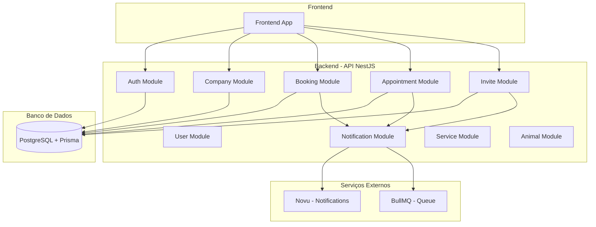
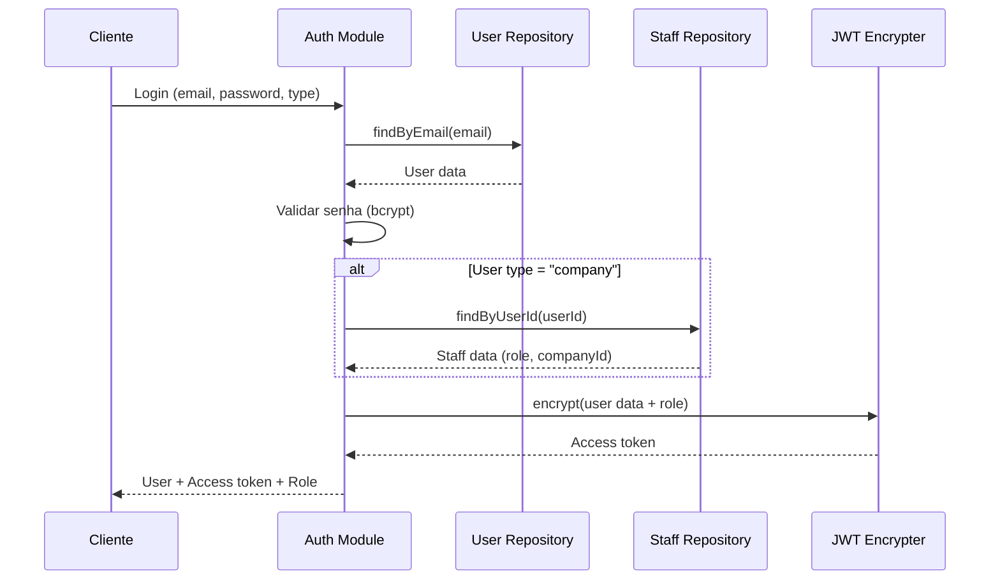
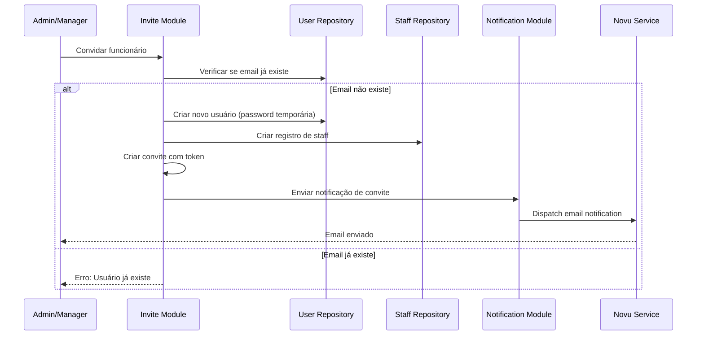
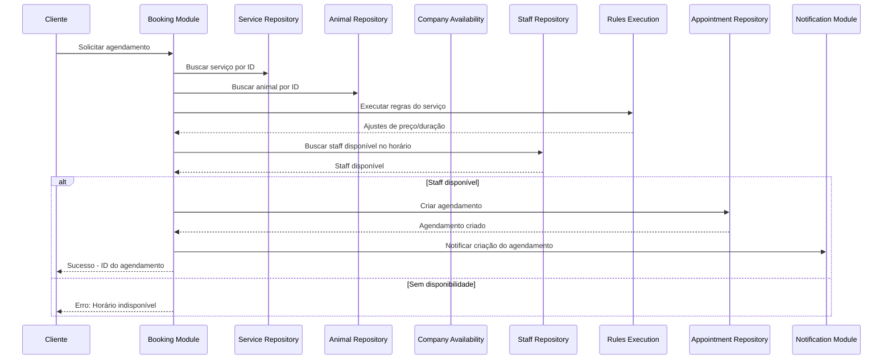
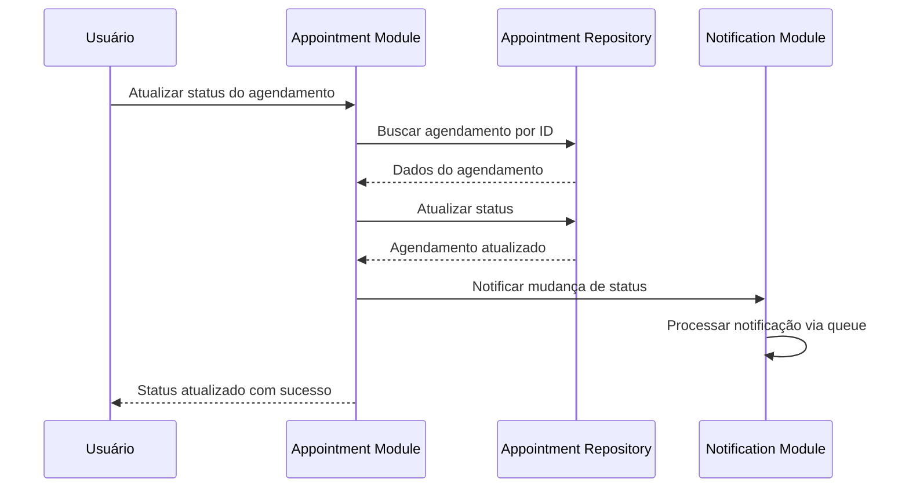
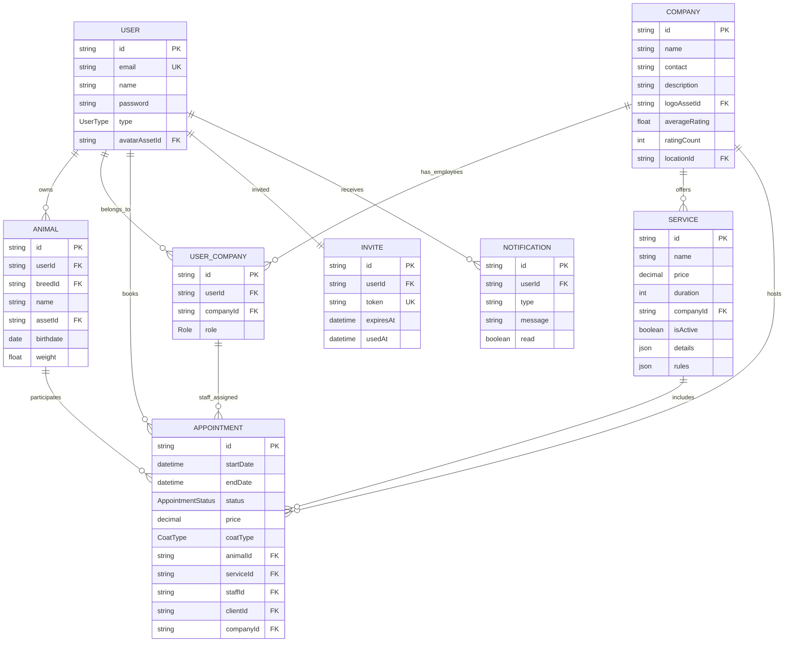
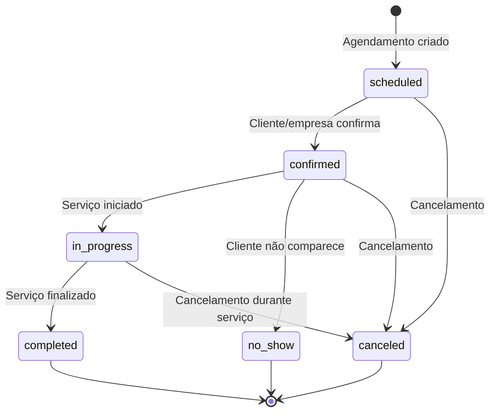
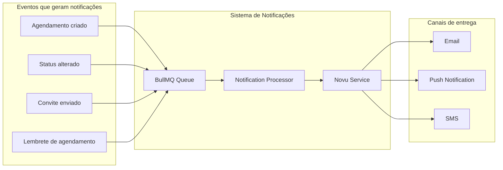
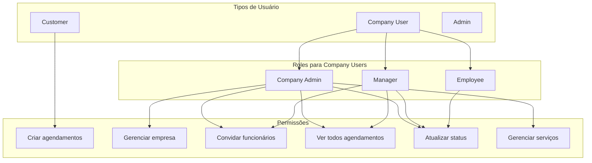

# Diagrama de Fluxo - Sistema Pet Shop

## Visão Geral da Arquitetura

## Fluxo de Autenticação e Login

## Fluxo de Convite de Funcionários

## Fluxo de Agendamento (Booking)

## Fluxo de Gerenciamento de Agendamentos

## Modelo de Dados - Relacionamentos Principais

## Estados dos Agendamentos

## Fluxo de Notificações

## Tipos de Usuários e Permissões

## Resumo dos Principais Fluxos

### 1. **Autenticação**
- Login diferenciado por tipo de usuário (customer/company/admin)
- JWT com informações de role e empresa
- Verificação de staff para usuários de empresa

### 2. **Gestão de Funcionários**
- Convite via email com token único
- Criação automática de usuário com senha temporária
- Associação com empresa via UserCompany

### 3. **Agendamento**
- Validação de disponibilidade de staff
- Execução de regras de negócio específicas
- Cálculo dinâmico de preço e duração
- Criação de appointment com todos os relacionamentos

### 4. **Notificações**
- Sistema assíncrono via BullMQ
- Integração com Novu para múltiplos canais
- Eventos automáticos em mudanças de estado

### 5. **Empresa e Serviços**
- Gestão de disponibilidade
- Configuração de serviços com regras customizáveis
- Sistema de avaliações e ratings

Este diagrama mostra como seu sistema está bem estruturado com separação clara de responsabilidades e um fluxo de dados bem definido entre os módulos.